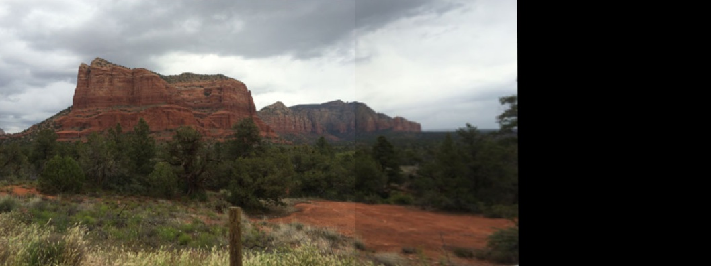

# CVIP-Image-stitching
Keypoints (SIFT descriptors or KAZE descriptors) were used to generate homography matrix using custom RANSAC algorithm. Implementation was done in Python using OpenCV.

Left Image:

Right Image:

Final Result

